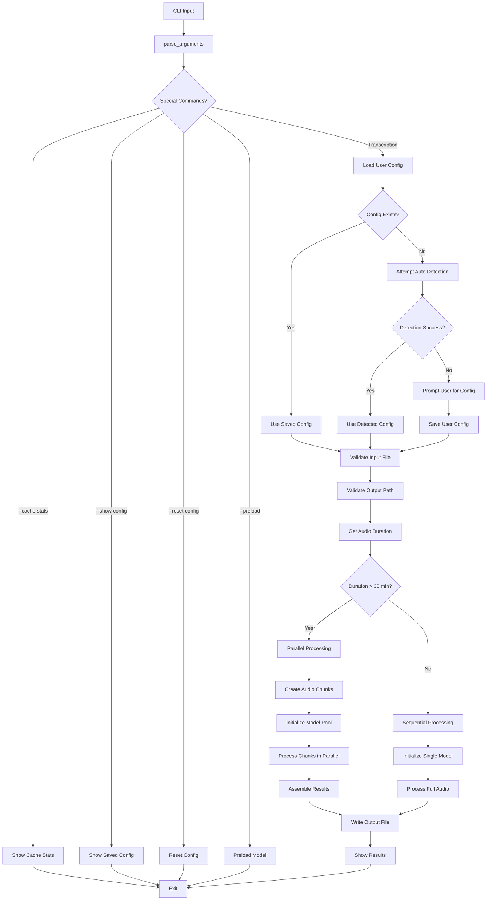
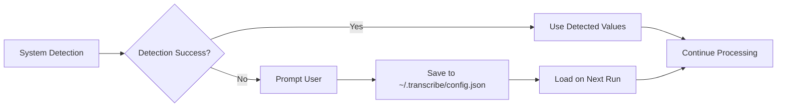
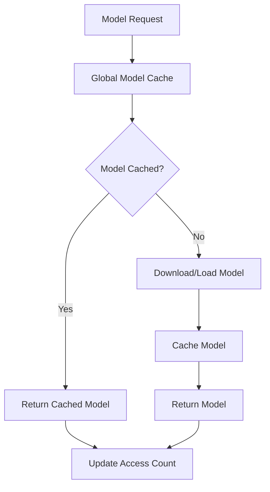
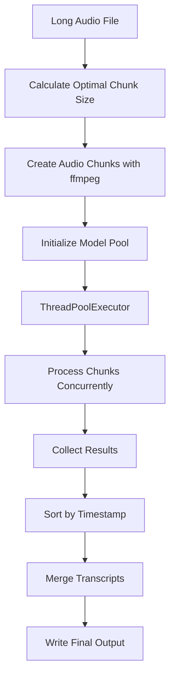
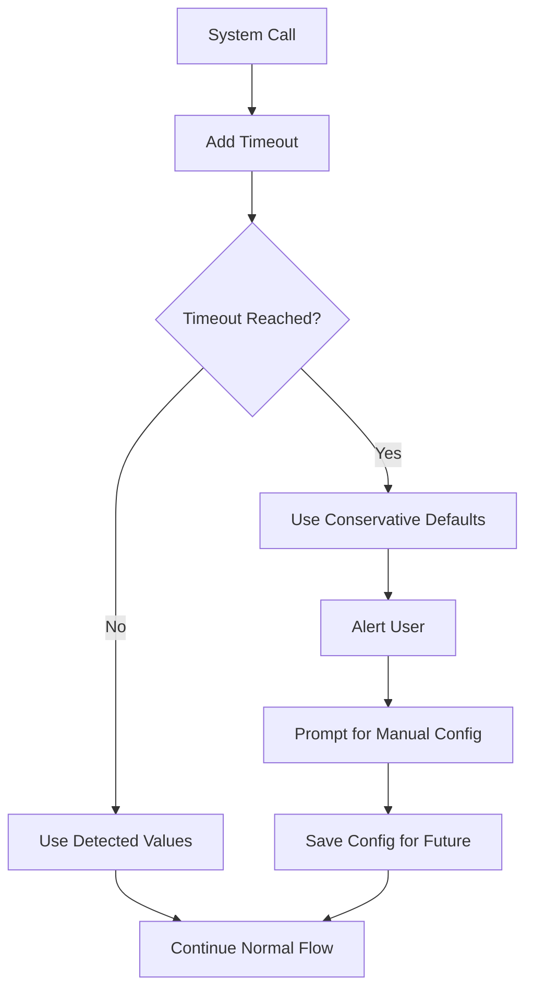

# Architecture Flow Diagram

This document describes the code flow from CLI input to transcription output.

## Main Flow



## Key Components

### Configuration System



### Model Management



### Parallel Processing Flow



### Error Handling & Timeout Prevention



## Key Design Decisions

1. **Single File Architecture**: All functionality in `transcribe.py` for simplicity
2. **Configuration Persistence**: Save user input to avoid repeated timeouts
3. **Conservative Defaults**: Fail safely with CPU processing when detection fails
4. **Model Caching**: Global cache to avoid repeated model loading
5. **Timeout Protection**: All system calls have timeouts to prevent hangs
6. **Graceful Degradation**: Fall back to simpler processing modes when needed

## File Processing Paths

### Small Files (< 30 minutes)
```
Input → Validation → Single Model → Transcribe → Output
```

### Large Files (> 30 minutes)  
```
Input → Validation → Chunking → Model Pool → Parallel Transcribe → Assembly → Output
```

### Error Recovery
```
Detection Failure → User Prompt → Config Save → Retry Processing
```

This architecture ensures reliable operation even when system detection fails, while providing optimal performance for different file sizes and hardware configurations.